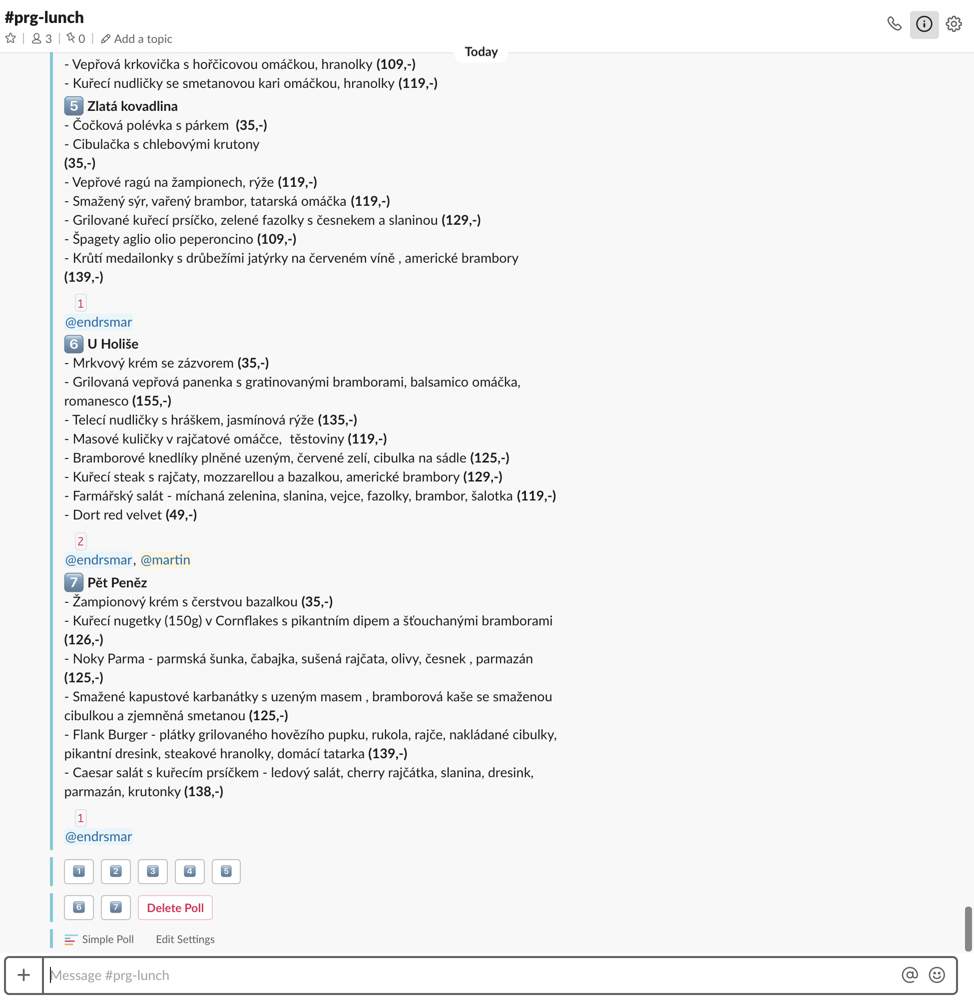

# prglunch

- Report daily lunch menus to your Slack
- Vote in Slack on where to go with your coworkers (voting done through Slack's Simple Poll)

### Issues, contributing
The main project repository lives in [GitLab](https://gitlab.com/melkamar/prglunch). Please file any issues there.

## Installation
The easiest way to get lunch notifications is to leverage the *free* GitLab CI/CD.

- Fork this repository on gitlab.com
- In `CI/CD` section, set up a `Schedule`. 
  - Set up menu sending whenever you want, I use cron expr `0 11 * * 1-5`
  - Set up two environment variables for the trigger - `SLACK_CHANNEL`, `SLACK_TOKEN`
    - You can generate a token in [Slack](https://api.slack.com/custom-integrations/legacy-tokens). Apparently they are deprecated, but they are fast to set up, so whatever.
    - The Slack channel ID is shown in the URL (when using Slack in the browser). See [this S/O question](https://stackoverflow.com/a/44883343/428173).

That's it, you should be good to go. You can manually trigger the scheduler to see if something gets reported.

### Customizing reported restaurants

You can customize which menus you get sent by enabling/disabling _scrapers_. To do that, head over to [prglunch.py](prglunch/prglunch.py#L15).

*If you end up creating your own scrapers, please create a MR to the upstream!*

## Screenshots

Inline-style: 
